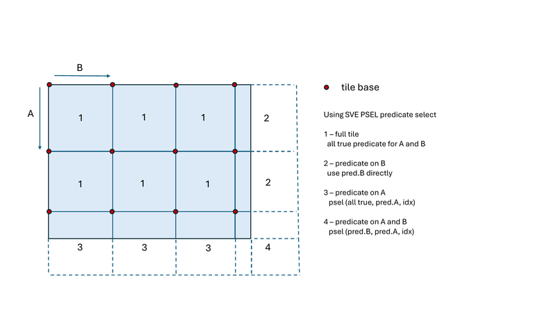

# [RFC] Ripple: A Compiler-Interpreted API for Efficient Vector Programming

# TL;DR
We have been working on Ripple, a lean addition to LLVM to support Single-Program, Multiple-Data (SPMD) and loop-annotation-based parallel programming for SIMD hardware. We propose a parallel programming API to support these two models, which departs from GPU-style SPMD programming, in that block computations of different dimensions (including 0) can coexist in the same function. This makes it easier to explicitly express mixes of scalar, vector and tensor computations.
Another key aspect of Ripple is that it does not require new kinds of
LLVM Instructions or types. Also, porting it to a new target does not require a new backend.
Finally, the Ripple API does not exclude other optimization forms.
For instance SIMD intrinsics and inline assembly can be used in a function that includes Ripple code.

# Motivation
The development of Ripple is driven by the need to simplify and enhance the process of writing efficient vectorized code for modern processors. As computational demands continue to grow across various domains, from machine learning to scientific computing, the ability to leverage hardware capabilities effectively becomes crucial.

Vector programming models currently supported by LLVM are mainly as follows:
- __Programming through intrinsics__. Intrinsics offer a great amount of control over how parallelism and data locality are exploited. They are specific to the targeted architecture, making it difficult to port to another architecture, and require developers to basically learn the targeted processor’s ISA.
- __Compiler-based vectorization__. This includes auto-vectorization passes such as the loop vectorizer and the SLP vectorizer, as well as OpenMP(R)'s `simd` loop annotation. These vectorization strategies rely on the compiler’s ability to model data dependencies and performance tradeoffs accurately to determine a vectorization strategy. In the case of OpenMP `simd`, the compiler determines if the developer hint is valid before attempting to vectorize the annotated loop.
- GPU-style __SPMD__ (Single Program, Multiple Data) through OpenCL(R) or CUDA(R).
While this approach does not rely as much on compiler analysis, it has two main limiting drawbacks: it forces developers to view the targeted architecture as a GPU, and its portability is labor-intensive, meaning that supporting a new architecture requires the development of a new specific SPIR-V backend. Many SIMD computer architectures are different from GPUs. In particular, they can be composed of scalar, vector and matrix engines. Having to model their computer as a GPU limits the compiler's ability to generate efficient code for non-GPUs.

These models are either limiting the developer’s ability to write SIMD code productively, by being too conservative, or they require a significant effort to port across SIMD architectures.

# Goals
Our main goal is to introduce a more direct contract between the developer and the compiler, in which the developer is trusted to know the data dependencies, the optimal mix of scalar, vector, and tensor SIMD computations, and the performance implications of such choices.

Developers need to be able to tailor their parallel program to the mix of scalar, vector and tensor execution units available in the targeted architecture.

The programming abstraction should be portable, i.e., the same across targeted SIMD architectures.

The programming abstraction should not preclude the use of target-specific SIMD builtins and inline assembly. This enables a gentle-slope optimization approach, in which developers can start with Ripple parallel code, and replace code portions with intrinsics or inline assembly if performance gaps are found.

## Non-goals
The goal is not to create a performance-portable solution.
While the API and its semantics are portable across SIMD architectures,
developers are expected to optimize their program for the particular hardware
they are compiling for, in terms of its SIMD width, caches, etc.


# Approach
The developer is given an API to specify parallelism and data locality, while the compiler interprets the API to “render” the vector program intended by the developer.

## Modeling SIMD processing elements as SPMD blocks
We propose the introduction of Ripple SPMD as a basis to express parallelism. As with GPU SPMD, processing elements are represented in a block, i.e., a tensor. An API is used to set and get the block shape, and to access processing element indices in the block.

The following one-dimensional example involves the Ripple SPMD API to compute an addition between two float vectors of size 8.
```C
1: void vector_add_1D(unsigned pindex, float *a, float *b, float *sum) {
2:  ripple_block_t BS = ripple_set_block_shape(VECTOR_PE, /* block index 0 with size */ 8);
3:  size_t ripple_index = ripple_id(BS, /* block index */ 0);
4:  sum[ripple_index] = a[ripple_index] + b[ripple_index];
5: }
```
`ripple_set_block_shape()` defines the shape of the SPMD block for a SIMD engine
nicknamed `VECTOR_PE`.
Here, we define a one-dimensional block of 8 Processing Elements.
The block for `VECTOR_PE` represents a collection of Processing Elements, mapped to SIMD lanes in a one-dimensional set indexed by `ripple_id(BS, 0)`.
The computation on Line 4 depends upon the the `ripple_id` call, and hence results in one-dimensional SIMD (a.k.a. "vector") instructions.

## Fixed block layout
Ripple defines a "layout" for block elements, i.e., a mapping between block elements and hardware SIMD elements.
The layout is column-major,
which is compatible with layout assumptions made in OpenCL(R) and CUDA(R):
- A row of block elements along dimension 0 is laid out onto a row of contiguous SIMD lanes.
- Then, dimension 1 of the block determines a contiguous sequence of rows within the SIMD lanes, etc.
- However, Ripple does not impose any contiguity across SIMD registers when a block takes up more than a single register. It is possible for specific hardware targets to enforce inter-register layout rules, which they can implement in their backend.

## Coexistence of instructions of different dimensions
Instructions that depend upon a subset of the block dimensions are executed by a sub-block defined by the subset of dimensions.
This rule enables the coexistence of instructions of different shapes.
These shapes are subsets of the function's block shape, as illustrated in the following code.

```C
ripple_block_t BS = ripple_set_block_shape(VECTOR_PE, 8, 8); // block shape is 8x8
size_t a = x * 3;             // scalar (assuming x is scalar)
size_t v0 = ripple_id(BS, 0); // shape(v0) = 8x1
size_t v1 = ripple_id(BS, 1); // shape(v1) = 1x8
size_t v_sum = v0 + v1 + a;   // shape = 8x8
```

An additional API is used to perform operations whose output shape is different from its input shape: reductions, broadcasting and slicing (see Ripple Manual for a description of this API).

Besides these API functions, the shape of an LLVM IR `Instruction` in the program is defined by the shape of its operands, through the implicit broadcast rule (broadcast operands to reach a common shape, which becomes the `Instruction`'s shape).

## LLVM-style shuffles
Vector element permutations, within and across vectors, are a very common operation in SIMD codes.
They enable intra-register-file data movement.
We defined an API for such movements, which we call "shuffles", following LLVM IR's naming.
- It takes one or two vectors and a function (called the "shuffle function"), which implicitly defines a list of immediate integer indices defining which source index to use for each destination lane. The Ripple pass instantiates the function to produce the list of integers, allowing the direct use of LLVM `shufflevector` instructions while exposing a higher-level interface to developers.
- It applies to the whole block. As a consequence:
  - Typically, developers write one shuffle function that depends upon the full block shape. If they modify the shape, they usually keep the same shuffle function.
  - Developers don't need to decompose their shuffles into native-vector shuffles (as in CUDA(R) or OpenCL(R)'s "sub-block" shuffles). LLVM does that for them.
We refer to the Manual for an API definition and examples.

## Predication through if-conversion
When the execution of code is conditioned by the value of a SIMD conditional, if-conversion is applied to the controlled code, resulting in the generation of masked code.

To illustrate this, in the following example, the increment line 5 becomes a sequence of 3 SIMD instructions: vector load, addition, and vector store.
However, since the line 5 increment lies within a block controlled by the
conditional of line 4, the output SIMD load and stores are executed conditionally. The SIMD conditional associated with the output load ans store
is true only for even SIMD lanes.

```C
1: void increment_even(int16_t x[8]) {
2:   ripple_block_t BS = ripple_set_block_shape(VECTOR_PE, 8);
3:   size_t v = ripple_id(BS, 0);
4:   if (v % 2 == 0)
5:     x[v] += 1;
6: }
```


## Loop parallelism support
A syntactic transformation in clang also enables the loop annotation parallel programming model. Similarly to OpenMP(R), the `ripple_parallel()` annotation defines that iterations of the annotated loop should be distributed repeatedly onto the block of Processing Elements, as illustrated in the following example.

```C
void vecadd_subarray(int N, int start, int end,
                     float x[N], float y[N], float xpy[N]) {
  ripple_block_t BS = ripple_set_block_shape(VECTOR_PE, 32);
  ripple_parallel(BS, 0);
  for (int i = start; i < N; ++i) {
    xpy[i] = x[i] + y[i];
  }
}
```

Ripple parallel loop annotations are also available in pragma form, as illustrated in the following example:

```C
void vecadd_subarray(int N, int start, int end,
                     float x[N], float y[N], float xpy[N]) {
  ripple_block_t BS = ripple_set_block_shape(VECTOR_PE, 32);
  #pragma ripple parallel Block(BS) Dims(0)
  for (int i = start; i < N; ++i) {
    xpy[i] = x[i] + y[i];
  }
}
```

`ripple_parallel` separates the loop into a full-vector loop followed by an epilogue.
Generating only the full-vector loop (when the user knows that N corresponds to a full set of vectors) can be done using
`ripple_parallel_full()` or by adding the `NoRemainder` clause to the `#pragma ripple parallel` annotation.

# Algorithm
The Ripple LLVM pass works in two sub-passes:
- Shape propagation, which associates a shape with each Instruction in the function it processes.
A shape is first associated with each `ripple_id()` call, and then propagated using the implicit broadcast rule and special propagation rules associated with Ripple API functions, in a control-independent, dataflow fixed-point algorithm.
- If-conversion. When shape propagation completes, the resulting `Instructions` can have a variety of shapes, including branching `Instructions`.
When a branching instruction depends upon a non-scalar value, the code it control gets if-converted.
We currently limit the CFG subgraphs controlled by non-scalar values to be mostly Single-Entry Single-Exit (SESE).
A pre-pass recovers SESE sub-CFGs that were folded into non-SESE forms.

# Design decisions rationale
## An API, as opposed to special keywords
- Makes Ripple portable across all the languages that support the function call construct.
- Maintains surface syntax compatibility with code analysis tools.

## Ripple as a target-independent LLVM compiler pass
- __Language portability__: Ripple SPMD is portable to any language based on LLVM. Only the Ripple Loop Annotation model requires a simple syntactic code transformation, typically implemented in the front-end.
-	__Target portability__: the Ripple pass produces target-independent scalar and vector code, which can be readily lowered by any SIMD LLVM backend.
We have been able to generate Hexagon(R), X86-64(R) and Arm(R) SIMD code using the same target-independent Ripple pass. We conjecture that more SIMD targets will be supported without much effort.

## Non-intrusive compiler addition
Ripple is designed to minimize the impact on the rest of LLVM.
- It does not introduce any new IR construct to express parallelism. Just new intrinsics.
- A representation for tensor types is maintained solely inside the Ripple pass. It relies on annotated LLVM IR vector types, as opposed to a new tensor LLVM IR type. The LLVM type system remains unchanged.
- SPMD support is contained within a couple compiler passes, and does not require the modification of other passes.
- Loop annotation support is contained in a clang Sema component.
- Ripple transformations are gated by the `-fenable-ripple` pass.

## Mixed block dimension support
The SPMD programming model relies on the modeling of processing elements as a “block”, i.e., a potentially multi-dimensional array of processing elements. While the GPU SPMD model states that all processing elements of a block execute the same code, the Ripple SPMD model states that statements that are dependent upon a subset of the block dimensions are executed by the sub-block defined by that dimension subset. This allows computations of various dimensions to coexist in the same function.
-	Developers are in control of which execution unit executes the code (scalar code executed by the scalar unit, vector code by the vector unit, etc.)
-	Developers are in control of which computations are done redundantly (along each dimension). For instance, the following codes are semantically equivalent but `foo_redundant` performs redundant computations, while `foo` doesn't.
```C
1: void foo(int a, int b, int *z) {
2:    ripple_block_t BS = ripple_set_block_shape(VECTOR_PE, 8);
3:    size_t v = ripple_id(BS, 0);
4:    int x = a * 2; // scalar
5:    int y = x + b; // scalar
6:    z[v] = y; // y is broadcasted here
7:}
```
```C
1: void foo_redundant(int a, int b, int *z) {
2:    ripple_block_t BS = ripple_set_block_shape(VECTOR_PE, 8);
3:    size_t v = ripple_id(BS, 0);
4:    int x = ripple_broadcast(BS, 0b1, a) * 2; // vector: a is explicitly broadcasted
5:    int y = x + b; // vector: b amd y are implicitly broadcasted
6:    z[v] = y; // vector (no implicit broadcasts necessary)
7:}
```

-	Ability to express SIMD vector and tensor code in conjunction with scalar code, but also along intrinsics and inline assembly. From a developer’s perspective, this enables a gentle slope development flow, in which intrinsics and inline assembly can be introduced along with Ripple code.

## Compiler pass supports target-independent API, libraries support target-specific instructions.
The SPMD and loop annotation programming model are convenient as they allow developers to write parallel code as annotated scalar code. SIMD processors are usually able to perform the vector equivalent of scalar computations (element-wise), and to move vector elements within and across vectors registers. These capabilities are treated in a target-independent fashion in the Ripple compiler pass.

However, SIMD processors also often come with SIMD instructions that are not found in other processors, and that are not an element-wise version of standard scalar operations. Ripple allows these SIMD instructions to be accessed in the SPMD and loop annotation models, through the support of vector libraries.

Vector library authors provide a scalar version of the instruction in a header file, and a vector version(s) in a binary (LLVM bit code) file.  Based on a naming convention, Ripple replaces the SIMD interpretation (“expansion”) of scalar library calls by calls to the associated vector function from the bitcode library.
Linking and inlining of these functions can be performed as a Ripple post-pass
or at link-time. The former option enables more optimizations across
library calls, while the latter still benefits from link-time optimization.


## Scalable SIMD architectures
The Ripple API currently supports fixed block shapes, which does not straightforwardly represent scalable SIMD architectures, such as the RISC-V(R) "V" extension and Arm(R) SVE.
In these architectures, a dynamically known "scale" factor defines how much larger the architecture running the program is from
the base SIMD width of the family of architectures (Arm SVE, RISC-V V).
We are considering several solutions for these architectures.

### Specialization
Developers can test the scale factor and specialize functions to a finite set of fixed scale factor values. This approach is easy to implement using templates in C++ and macros in C. However, the portability of codes written in this style will be limited to the scale factors chosen for the specialization. Additionally, specialization multiplies code size by the number of instances used in the specialization.

### Future work: dynamic block sizes
We are considering an extension of Ripple in which the last dimension of SIMD blocks can be dynamically defined.
This would allow developers to define their code as a function of the scale factor.

```C
size_t scale; // will represent the scale factor
// ...
auto BS = ripple_set_block_shape(VECTOR_PE, 8, scale);
```

Enabling the last dimension to be dynamic enables a dynamic block size without compromising Ripple's ability to detect static coalescing, which could happen if we allowed all dimensions to be dynamic.

# Related work
## SPMD (Single Program, Multiple Data)
The SPMD programming model has been around for decades, and made popular by MPI, the Message Passing Interface.
In the 2000’s, CUDA(R) used SPMD to express multi-level parallelism,
including instruction-level parallelism for NVIDIA(R)’s programmable GPUs.
This traditional form of SPMD (which we refer to as “GPU SPMD” in this RFC) assumes that an entire set of homogeneous processing elements, represented as a block, executes the same program monolithically. The Ripple SPMD model introduces the ability to represent heterogeneous processing elements, and to have only subsets of the processing elements (of different dimensions) execute the program.

## OpenCL (R)
The OpenCL(R) norm recapitulated the CUDA(R) model, maintaining architectural constraints from a GPU (synchronization capabilities, local memory structure) in the programming model. Limitations on the types of formal parameters that can be passed to OpenCL functions (e.g. constant size) were also inherited from GPU-specific constraints. These constraints are irrelevant to many non-GPU processors, and we claim that they often prevent developers from writing efficient vector code on non-GPU machines.

## SYCL (R)
SYCL defines a set of classes to represent data parallel computations in C++,
using OpenCL's underlying concepts.
A "parallel loop" concept is available through a SYCL handler method.

## HIP
HIP is another implementation of the GPU SPMD programming model.
A distinguishing feature of HIP is that it can compile the same program for execution onto the host and the GPU device.

## OpenMP (R)
OpenMP(R) was originally developed to write multi-threaded code for shared-memory machines. It received many improvements since its creation. Among others, it is now able to offload code to an accelerator, and hint at the possibility of auto-vectorization along loop dimensions. A major difference between OpenMP and Ripple’s loop annotation model is that with Ripple, the user dictates the vectorization, and the compiler just renders the user’s vectorization choice.
While OpenMP treats a `simd` annotation as a hint and leaves the decision
to vectorize to the compiler, with Ripple, the decision to generate vector code is not gated by compiler analysis.

## OpenACC (R)
OpenACC (R) is a pragma-based loop annotation system,
which defines loop transformations to be performed by the OpenACC-supporting compiler.
Loop transformations targeted by OpenACC include some forms of tiling, computation offloading, and also vectorization.
Because of its large intersection with OpenMP(R), OpenACC is mainly implemented
in terms of OpenMP in LLVM.
OpenACC doesn't offer an SPMD programming model.

## C++23 simd
C++ 23 offers an experimental simd class to represent (one-dimensional) SIMD vectors.
The simd interface includes (one-dimensional, full) reductions,
standard math functions ad alignment tags.
Most notable differences between c++23 simd and Ripple are the supported languages, the lack of a loop vectorization notation in C++ simd, and
the number of supported SIMD dimensions (limited to one in C++ simd).

# References
[Ripple Manual]
A programmer's manual for Ripple is available at
`http://github.com/qualcomm/Ripple/ripple-manual.pdf`

An implementation of Ripple in LLVM is available at
`http://github.com/qualcomm/Ripple`

# Appendix 1: Ripple MLIR dialect

We offer a core set of Ripple intrinsics in a standalone MLIR dialect that can be lowered into LLVM Ripple intrinsics. At this moment, we offer operations to model SIMD blocks, perform reductions, broadcasting, slicing, and LLVM-style shuffles. Operations in the `ripple` dialect are prefixed by `ripple`.

The following example provides a way to define SIMD blocks for MLIR.

```C
func.func @main() {
    %peid = arith.constant 0 : i32
    %dim = arith.constant 0 : i32
    %size_1 = arith.constant 2 : i32
    %size_2 = arith.constant 128 : i32

    %bs = ripple.setshape %peid [%size_1, %size_2 : i32, i32] : i32 -> !ptr.ptr<#ptr.generic_space>
    %nv = ripple.getsize %bs [%dim : i32 to i32] : !ptr.ptr<#ptr.generic_space>

    return
}
```

In the custom assembly format, an opaque pointer is used to represent the struct that contains the Ripple block information. This pointer is passed to further operations like `getsize` to explicitly identify SIMD shape information over keeping global shape information. We identify specific SIMD lanes using the `%dim` argument as before.

The following example details how to use the Ripple block information to write an explicitly broadcasted vector and extract slices out of it.

```C
func.func @main() {
    ...
    %bs = ripple.setshape %peid [%size_1, %size_2 : i32] : i32 -> !ptr.ptr<#ptr.generic_space>
    %v0 = ripple.index (%bs : !ptr.ptr<#ptr.generic_space>) [%dim : i32] -> i32
    %nv = ripple.getsize (%bs : !ptr.ptr<#ptr.generic_space>) [%dim : i32] -> i32

    %zero = arith.constant 0 : i64
    %vzero = ripple.broadcast (%bs : !ptr.ptr<#ptr.generic_space>) [ %zero : i64, %dim : i32] -> i32

    %slice = arith.constant -1 : i64
    %vzero_half = ripple.slice [%vzero : i32, %slice : i64, %zero : i32] -> i32

    return
}
```

We also provide a way to write LLVM-style shuffles similar to the C API. The shuffle function needs to be defined within the scope of the call.

```C
func.func @foo(%k : i32, %n : i32) -> i32 {
    %result = %arith.subi %n, %k : i32
    return %result
}

func.func @main() {
    ...

    %foo = func.constant @foo : (i32, i32) -> i32
    %vzero_shuff = ripple.ishuffle [%vzero : i32, %foo : (i32, i32) -> i32] -> i32

    return
}
```

# Appendix 2: C to AArch64 SME optimization using Ripple

## Motivation
SME offers two-dimensional SIMD instructions.
Since Ripple enables the expression of SIMD computations through multi-dimensional SPMD block computations,
we implemented a way to generate SME's two-dimensional SIMD instructions from Ripple codes based on two-dimensional blocks.

The design constraints are as follows:
- The Ripple pass is part of the target-independent optimizations in LLVM.
It itself is a target-independent pass.
This helps maintain a strong separation between target-independent code, which belongs in the Ripple passes, and target-dependent code, which belongs in the target backends and compiler libraries.
- A multi-dimensional representation of blocks is maintained within the Ripple pass only. Outside the Ripple pass, LLVM's vector representation is used for SIMD computations.

After Ripple vectorization, matrix-matrix and matrix-vector operations are performed on LLVM IR vectors. To fully utilize the 64-bit ARM(R) Scalable Matrix Extension (SME) matrix processing engine, our pass reconstructs the matrix structure from the vector form and applies an intrinsic selection pass to choose efficient SVE/SME instructions that leverage the 512-bit vector and matrix processing capabilities.

The resulting Ripple AArch64 SME compiler enables automatic C-to-SME code generation through a combination of user-space Ripple annotations, compiler IR rewriting based on pattern recognition, and SVE/SME intrinsic selection.

The following section presents the proposed approach for
outer-product matrix multiplication, and transposition.

## Approach: An IR rewriter
To enable compiler automatic generation of SVE/SME code, matrix-matrix and matrix-vector operations must be identified and transformed into their equivalent SVE/SME intrinsic instructions. To support this, a late IR early code generation pass called __SVESMEIntrinsicSelection Pass__ is introduced. This pass converts Ripple vectorized fixed-length wide vectors patterns into AArch64 SVE/SME intrinsics. Alternatively, intrinsic selection can also be applied as a post Ripple processing pass.

In essence, this IR rewriting approach focuses on recognizing and reconstructing matrix information from 1D vector operations through pattern matching, and selecting efficient SVE/SME intrinsics accordingly.

The main functionality of this IR rewriter includes outer-product selection, store expansion, loop construction and predicate generation. Additionally, certain matrix/vector operations -- such as `shufflevector` used for transpose and interleave -- can be pattern-matched and replaced with corresponding SVE/SME instructions, further extending the capabilities of this IR rewriter.

To illustrate the core functionalities of the compiler transformation, we walk through a series of IR transformation examples in the next section. These examples are based on floating-point data types, using a 32x32 block size and assuming a streaming vector length of 512 bits.

### Outer-product selection
Consider matrix-matrix multiplication, where __C = A x B__ is computed as a sum of outer products, as from the Ripple code below.

```C
#include <ripple.h>
#define SME_LANES 0
#define SME_SIZE 32

void matmul_arg(float *A, float *B, float *C, int M, int N, int K) {
  ripple_block_t sme_block =
    ripple_set_block_shape(SME_LANES, SME_SIZE, SME_SIZE);
  ripple_parallel(sme_block, 1);
  for (int i = 0; i < M; i++) {
    ripple_parallel(sme_block, 0);
    for (int j = 0; j < N; j++) {
      __builtin_assume(K > 0);
      float tile = 0;
      for (int k = 0; k < K; k++) {
        tile += A[k * M + i] * B[k * N + j];
      }
      C[i * N + j] = tile;
    }
  }
}
```

This formulation is well-suited for leveraging the ARM Scalable Matrix Extension (SME), which is optimized for accelerating matrix operations, such as outer products.

The IR example below illustrates one iteration of the `k` loop performing an outer product. Vectors A and B are first loaded, each as an `nx32f32` vector. The vector load from A goes through a horizontal splat (a particular shuffle) to form a matrix-like structure represented as `nx1024f32`, while the vector load from B is vertically splatted (shuffled) to produce a similar `nx1024f32` layout. A fused multiply-add (fmuladd) is then applied to these reshaped vectors.

This sequence of vector operations effectively maps to SME FMOPA instruction. The role of the IR rewriter is to recognize this pattern and replace it with the corresponding SME intrinsic. This transformation also involves splitting the fixed-length `nx32f32` vector loads into two scalable nxv4f32 vectors and utilizing all four available tiles in SME's ZA matrix register.

```llvm
  %load.A = load <32 x float>, ptr %arrayidx9, align 4
  %.ripple.bcast = shufflevector <32 x float> %load.A, <32 x float> poison, <1024 x i32> <i32 0, i32 0, ..., i32 0, i32 1, i32 1, ..., i32 1, ... , i32 31, i32 31, ..., i32 31> ; horizontal shuffle
  %load.B = load <32 x float>, ptr %arrayidx15, align 4
  %.ripple.bcast129 = shufflevector <32 x float> %load.B, <32 x float> poison, <1024 x i32> <i32 0, i32 1, ..., i32 31, i32 0, i32 1, ..., i32 31, ..., i32 0, i32 1, ..., i32 31> ; vertical shuffle
  %.ripple.vectorized = tail call <1024 x float> @llvm.fmuladd.v1024f32(<1024 x float> %.ripple.bcast, <1024 x float> %.ripple.bcast129, <1024 x float> %tile.041.ripple.vectorized)
```

The transformed IR is shown below.
```llvm
  %load.A = load <32 x float>, ptr %arrayidx9, align 4
  %load.B = load <32 x float>, ptr %arrayidx15, align 4
  %A0 = call <16 x float> @llvm.vector.extract.v16f32.v32f32(<32 x float> %load.A, i64 0)
  %A0.vscale = call <vscale x 4 x float> @llvm.vector.insert.nxv4f32.v16f32(<vscale x 4 x float> poison, <16 x float> %A0, i64 0)
  %A1 = call <16 x float> @llvm.vector.extract.v16f32.v32f32(<32 x float> %load.A, i64 16)
  %A1.vscale = call <vscale x 4 x float> @llvm.vector.insert.nxv4f32.v16f32(<vscale x 4 x float> poison, <16 x float> %A1, i64 0)
  %B0 = call <16 x float> @llvm.vector.extract.v16f32.v32f32(<32 x float> %load.B, i64 0)
  %B0.vscale = call <vscale x 4 x float> @llvm.vector.insert.nxv4f32.v16f32(<vscale x 4 x float> poison, <16 x float> %B0, i64 0)
  %B1 = call <16 x float> @llvm.vector.extract.v16f32.v32f32(<32 x float> %load.B, i64 16)
  %B1.vscale = call <vscale x 4 x float> @llvm.vector.insert.nxv4f32.v16f32(<vscale x 4 x float> poison, <16 x float> %B1, i64 0)
  ; The first parameter specifies the tile id.
  call void @llvm.aarch64.sme.mopa.nxv4f32(i32 0, <vscale x 4 x i1> splat (i1 true), <vscale x 4 x i1> splat (i1 true), <vscale x 4 x float> %A0.vscale, <vscale x 4 x float> %B0.vscale)
  call void @llvm.aarch64.sme.mopa.nxv4f32(i32 1, <vscale x 4 x i1> splat (i1 true), <vscale x 4 x i1> splat (i1 true), <vscale x 4 x float> %A0.vscale, <vscale x 4 x float> %B1.vscale)
  call void @llvm.aarch64.sme.mopa.nxv4f32(i32 2, <vscale x 4 x i1> splat (i1 true), <vscale x 4 x i1> splat (i1 true), <vscale x 4 x float> %A1.vscale, <vscale x 4 x float> %B0.vscale)
  call void @llvm.aarch64.sme.mopa.nxv4f32(i32 3, <vscale x 4 x i1> splat (i1 true), <vscale x 4 x i1> splat (i1 true), <vscale x 4 x float> %A1.vscale, <vscale x 4 x float> %B1.vscale)
```

### Store expansion and loop construct
In the Ripple vectorized IR, a 32x32 matrix block is stored using a single store instruction `store <1024 x float>`. However, neither SVE nor SME supports a single instruction to write the entire ZA matrix directly to memory. As a result, the compiler must generate a loop structure that stores each vector slice of the ZA matrix to memory line by line.

```llvm
for.cond.cleanup7:                                ; preds = %for.body8
  %arrayidx22 = getelementptr inbounds nuw [16 x [32 x [32 x float]]], ptr %C, i64 %indvars.iv51, i64 %indvars.iv46, i64 0, i64 0
  store <1024 x float> %.ripple.vectorized, ptr %arrayidx22, align 4
  ...
  br i1 %exitcond50.not, label %for.cond.cleanup3, label %for.cond5.preheader

for.body8:                                        ; preds = %for.cond5.preheader, %for.body8
  %indvars.iv = phi i64 [ 0, %for.cond5.preheader ], [ %indvars.iv.next, %for.body8 ]
  %tile.041.ripple.vectorized = phi <1024 x float> [ zeroinitializer, %for.cond5.preheader ], [ %.ripple.vectorized, %for.body8 ]
  ...
  %.ripple.vectorized = tail call <1024 x float> @llvm.fmuladd.v1024f32(<1024 x float> %.ripple.bcast, <1024 x float> %.ripple.bcast134, <1024 x float> %tile.041.ripple.vectorized)
  %indvars.iv.next = add nuw nsw i64 %indvars.iv, 1
  %exitcond.not = icmp eq i64 %indvars.iv.next, %K
  br i1 %exitcond.not, label %for.cond.cleanup7, label %for.body8
```

The transformed IR below demonstrates how the IR rewriter introduces a new control flow exit from the original outer-product k loop to a `%store.preheader` block. From there, execution branches to `%store.body`, where the ZA matrix is stored slice by slice. Once storing is complete, control proceeds to the original loop exit at `%for.cond.cleanup7`.

This loop-based structure replaces the original `store <1024 x float>`. Additionally, data from the ZA tiles is read out as 8-bit integers (i8), allowing two output Z vector registers to be stored contiguously in memory.

```llvm
store.preheader:                                  ; preds = %for.body8
  ...
  br label %store.body

store.body:                                       ; preds = %store.body, %store.preheader
  %indvar.st = phi i64 [ 0, %store.preheader ], [ %indvar.st.next, %store.body ]
  ...
  ; The third parameter specifies the tile id.
  %v0 = call <vscale x 16 x i8> @llvm.aarch64.sme.read.horiz.nxv16i8(<vscale x 16 x i8> undef, <vscale x 16 x i1> splat (i1 true), i32 0, i32 %slice.0)
  %v1 = call <vscale x 16 x i8> @llvm.aarch64.sme.read.horiz.nxv16i8(<vscale x 16 x i8> undef, <vscale x 16 x i1> splat (i1 true), i32 0, i32 %slice.1)
  %v2 = call <vscale x 16 x i8> @llvm.aarch64.sme.read.horiz.nxv16i8(<vscale x 16 x i8> undef, <vscale x 16 x i1> splat (i1 true), i32 0, i32 %slice.2)
  %v3 = call <vscale x 16 x i8> @llvm.aarch64.sme.read.horiz.nxv16i8(<vscale x 16 x i8> undef, <vscale x 16 x i1> splat (i1 true), i32 0, i32 %slice.3)
  call void @llvm.masked.store.nxv4f32.p0(<vscale x 4 x float> %v0.cast, ptr %st.addr0, i32 4, <vscale x 4 x i1> splat (i1 true))
  call void @llvm.masked.store.nxv4f32.p0(<vscale x 4 x float> %v1.cast, ptr %st.addr1, i32 4, <vscale x 4 x i1> splat (i1 true))
  call void @llvm.masked.store.nxv4f32.p0(<vscale x 4 x float> %v2.cast, ptr %st.addr2, i32 4, <vscale x 4 x i1> splat (i1 true))
  call void @llvm.masked.store.nxv4f32.p0(<vscale x 4 x float> %v3.cast, ptr %st.addr3, i32 4, <vscale x 4 x i1> splat (i1 true))
  %indvar.st.next = add i64 %indvar.st, 1
  %exit.cond = icmp eq i64 %indvar.st.next, 16
  br i1 %exit.cond, label %for.cond.cleanup7, label %store.body

for.cond.cleanup7:                                ; preds = %store.body
  ...
  br i1 %exitcond50.not, label %for.cond.cleanup3, label %for.cond5.preheader

for.body8:                                        ; preds = %for.cond5.preheader, %for.body8
  %indvars.iv = phi i64 [ 0, %for.cond5.preheader ], [ %indvars.iv.next, %for.body8 ]
  ...
  call void @llvm.aarch64.sme.mopa.nxv4f32(i32 0, <vscale x 4 x i1> splat (i1 true), <vscale x 4 x i1> splat (i1 true), <vscale x 4 x float> %27, <vscale x 4 x float> %31)
  call void @llvm.aarch64.sme.mopa.nxv4f32(i32 1, <vscale x 4 x i1> splat (i1 true), <vscale x 4 x i1> splat (i1 true), <vscale x 4 x float> %27, <vscale x 4 x float> %33)
  call void @llvm.aarch64.sme.mopa.nxv4f32(i32 2, <vscale x 4 x i1> splat (i1 true), <vscale x 4 x i1> splat (i1 true), <vscale x 4 x float> %29, <vscale x 4 x float> %31)
  call void @llvm.aarch64.sme.mopa.nxv4f32(i32 3, <vscale x 4 x i1> splat (i1 true), <vscale x 4 x i1> splat (i1 true), <vscale x 4 x float> %29, <vscale x 4 x float> %33)
  %indvars.iv.next = add nuw nsw i64 %indvars.iv, 1
  %exitcond.not = icmp eq i64 %indvars.iv.next, %K
  br i1 %exitcond.not, label %store.preheader, label %for.body8
```

### Predicate generation for partial tiles
ARM SME/SVE2.1 introduces the __PSEL__ (Predicate Select) instruction, which enables predicate selection between a predicate register and an all-false predicate. In other words, PSEL copies the contents of the first source predicate register into the destination predicate register if the indexed element in the second source predicate is true; otherwise it sets the destination predicate to all-false.

When handling arbitrary matrix sizes, there are four types of tile, each requiring a different strategy to generate the final predicate used during vector stores: 1. Full tiles: Use all-true predicate; 2. Tiles with predication on B: Apply pred.B directly; 3. Tiles with predication on A: Use pred.A to select between all-true and all-false; 4. Tiles with predication on both A and B: Use pred.A to select pred.B.


The IR snippet shown below is extracted from tile 4 to illustrate this logic.

```llvm
  %cmp145 = icmp slt <32 x i32> %add144.ripple.LS.instance.ripple.branch.clone, %N.ripple.bcast.splat538
  %cmp145.bcast = shufflevector <32 x i1> %cmp145, <32 x i1> poison, <1024 x i32> <i32 0, i32 1, ..., i32 31, i32 0, i32 1, ..., i32 31, ..., i32 0, i32 1, ..., i32 31> ; vertical shuffle on pred.B
  ...
  %cmp87 = icmp slt <32 x i32> %add86.ripple.vectorized, %M.ripple.bcast.splat
  %cmp87.bcast = shufflevector <32 x i1> %cmp87, <32 x i1> poison, <1024 x i32> <i32 0, i32 0, ..., i32 0, i32 1, i32 1, ..., i32 1, ..., i32 31, i32 31, ..., i32 31> ; horizontal shuffle on pred.A
  ...
  %.ripple.branch.mask.apply563 = and <1024 x i1> %cmp145.bcast, %cmp87.bcast
  tail call void @llvm.masked.scatter.v1024f32.v1024p0(<1024 x float> %.ripple.vectorized549, <1024 x ptr> %arrayidx172, i32 4, <1024 x i1> %.ripple.branch.mask.apply563)
```

In the transformed IR, `icmp` instructions originally used to construct mask for `masked.scatter` instruction are repurposed to generate four SVE `whilelt` instructions--two for pred.A and two for pred.B. These are followed by `psel` instructions, which use `pred.A` to select either `pred.B` or an all-false predicate. The resulting predicates are then passed to `masked.store` instructions to complete the data write.

```llvm
store.preheader13:                                ; preds = %for.body156.ripple.branch.clone.ripple.branch.clone
  %tilebase.jj.2 = add i64 %tilebase.jj, 16
  %pred.B0 = call <vscale x 4 x i1> @llvm.aarch64.sve.whilelt.nxv4i1.i64(i64 %tilebase.jj, i64 %N)
  %pred.B1 = call <vscale x 4 x i1> @llvm.aarch64.sve.whilelt.nxv4i1.i64(i64 %tilebase.jj.2, i64 %N)
  %pred.B0.conv = call <vscale x 16 x i1> @llvm.aarch64.sve.convert.to.svbool.nxv4i1(<vscale x 4 x i1> %pred.B0)
  %pred.B1.conv = call <vscale x 16 x i1> @llvm.aarch64.sve.convert.to.svbool.nxv4i1(<vscale x 4 x i1> %pred.B1)
  %tilebase.ii.2 = add i64 %tilebase.ii, 16
  %pred.A0 = call <vscale x 4 x i1> @llvm.aarch64.sve.whilelt.nxv4i1.i64(i64 %tilebase.ii, i64 %M)
  %pred.A1 = call <vscale x 4 x i1> @llvm.aarch64.sve.whilelt.nxv4i1.i64(i64 %tilebase.ii.2, i64 %M)
  ...
  br label %store.body12

store.body12:                                     ; preds = %store.body12, %store.preheader13
  %indvar.st = phi i64 [ 0, %store.preheader13 ], [ %191, %store.body12 ]
  ...
  %idx = trunc i64 %indvar.st to i32
  %pred.st0 = call <vscale x 16 x i1> @llvm.aarch64.sve.psel.nxv4i1(<vscale x 16 x i1> %pred.B0.conv, <vscale x 4 x i1> %pred.A0, i32 %idx)
  %pred.st0.conv = call <vscale x 4 x i1> @llvm.aarch64.sve.convert.from.svbool.nxv4i1(<vscale x 16 x i1> %pred.st0)
  %pred.st1 = call <vscale x 16 x i1> @llvm.aarch64.sve.psel.nxv4i1(<vscale x 16 x i1> %pred.B1.conv, <vscale x 4 x i1> %pred.A0, i32 %idx)
  %pred.st1.conv = call <vscale x 4 x i1> @llvm.aarch64.sve.convert.from.svbool.nxv4i1(<vscale x 16 x i1> %pred.st1)
  %pred.st2 = call <vscale x 16 x i1> @llvm.aarch64.sve.psel.nxv4i1(<vscale x 16 x i1> %pred.B0.conv, <vscale x 4 x i1> %pred.A1, i32 %idx)
  %pred.st2.conv = call <vscale x 4 x i1> @llvm.aarch64.sve.convert.from.svbool.nxv4i1(<vscale x 16 x i1> %pred.st2)
  %pred.st3 = call <vscale x 16 x i1> @llvm.aarch64.sve.psel.nxv4i1(<vscale x 16 x i1> %pred.B1.conv, <vscale x 4 x i1> %pred.A1, i32 %idx)
  %pred.st3.conv = call <vscale x 4 x i1> @llvm.aarch64.sve.convert.from.svbool.nxv4i1(<vscale x 16 x i1> %pred.st3)
  call void @llvm.masked.store.nxv4f32.p0(<vscale x 4 x float> %v0, ptr %addr0, i32 4, <vscale x 4 x i1> %pred.st0.conv)
  call void @llvm.masked.store.nxv4f32.p0(<vscale x 4 x float> %v1, ptr %addr1, i32 4, <vscale x 4 x i1> %pred.st1.conv)
  call void @llvm.masked.store.nxv4f32.p0(<vscale x 4 x float> %v2, ptr %addr2, i32 4, <vscale x 4 x i1> %pred.st2.conv)
  call void @llvm.masked.store.nxv4f32.p0(<vscale x 4 x float> %v3, ptr %addr3, i32 4, <vscale x 4 x i1> %pred.st3.conv)
  ...
  %indvar.st.next = add i64 %indvar.st, 1
  %exit.cond = icmp eq i64 %indvar.st.next, 16
  br i1 %exit.cond, label %for.cond.cleanup155.ripple.branch.clone.ripple.branch.clone, label %store.body12
```

### ShuffleVector pattern matching
The previous sections demonstrated the core compiler transformations required for automatic C-to-SME code generation for matrix multiplication. However, the Ripple API offers more flexibility and broader capabilities, allowing compiler transformations to extend beyong matrix multiplication. For instance, the `ripple_shuffle` API allows user to define custom mappings from source to destination indices, effectively supporting generalized shuffle operations. This is particularly useful to support matrix transpose or interleave operations. Let's use tile-based matrix transpose as an example to illustrate.

#### Transpose: Mapping ShuffleVector to SME ZA tile loads and stores

Consider the following Ripple transposition code:
```C
#include <ripple.h>
#include <assert.h>
#define TILE_SIZE 32

static __attribute__((always_inline)) float transpose_tile(float *tile_addr,
                                                           size_t v) {
  auto transpose = [](size_t k, size_t block_size) -> size_t {
    unsigned offset = k / TILE_SIZE;
    unsigned row_idx = k % TILE_SIZE;
    return row_idx * TILE_SIZE + offset;
  };
  return ripple_shuffle(tile_addr[v], transpose);
}

void transpose_ripple(float *dest, float *src, unsigned m, unsigned k) {
  assert(m % TILE_SIZE == 0);
  assert(k % TILE_SIZE == 0);
  ripple_block_t sme_block = ripple_set_block_shape(0, TILE_SIZE, TILE_SIZE);
  size_t x = ripple_id(sme_block, 0);
  size_t y = ripple_id(sme_block, 1);
  for (int i = 0; i < m; i += TILE_SIZE)
    for (int j = 0; j < k; j += TILE_SIZE) {
      dest[y * TILE_SIZE + x] = transpose_tile(&src[i * k + j], y * k + x);
      dest += TILE_SIZE * TILE_SIZE;
    }
}
```
Since the matrix is flattened into a 1D vector, the transpose operation becomes a reordering of indices--selecting column elements line by line. This tile-based transpose (using 32x32 blocks) aligns well with SME hardware capabilities, which support horizontal load of vectors into ZA matrix tiles and vertically storing of those vectors to memory.

In the tile-based matrix transpose code below,
the Ripple vectorized IR typically consists of three steps:
1. A load of 32x32 matrix tile;
2. A `shufflevector` instruction that rearrange the matrix from row-major to column-major order;
3. A store of the transposed result.


```llvm
for.body7:                                       ; preds = %for.body7.lr.ph, %for.body7
  ...
  %load = tail call <1024 x float> @llvm.masked.gather.v1024f32.v1024p0(<1024 x ptr> %gep, i32 4, <1024 x i1> splat (i1 true), <1024 x float> poison)
  %.ripple.vectorized = shufflevector <1024 x float> %load, <1024 x float> poison, <1024 x i32> <i32 0, i32 32, ..., i32 992, i32 1, i32 33, ..., i32 993, ..., i32 31, i32 63, ..., i32 1023> ; transpose of a 32x32 block
  store <1024 x float> %.ripple.vectorized, ptr %dest.addr.132, align 4
  ...
  br i1 %exit.cond, label %for.body7, label %for.cond.cleanup9
```

The IR rewriter will identify the "load + shufflevector + store" pattern and transform it into two explicit loops:
- One loop loads data horizontally into the ZA matrix tiles;
- The other loop stores data vertically from the ZA matrix to memory.

This transformation eliminates the need for `shufflevector` instruction entirely. A reversed order -- loading vertically and storing horizontally -- would achieve the same effect.

```llvm
for.body7:                                        ; preds = %for.body7, %for.body7.lr.ph
  ...
  br label %load.loop

load.loop:
  ...
  ; The third parameter specifies the tile id.
  call void @llvm.aarch64.sme.ld1w.horiz(<vscale x 4 x i1> splat (i1 true), ptr %load.gep.tile0, i32 0, i32 %ld.iv.trunc)
  call void @llvm.aarch64.sme.ld1w.horiz(<vscale x 4 x i1> splat (i1 true), ptr %load.gep.tile1, i32 1, i32 %ld.iv.trunc)
  call void @llvm.aarch64.sme.ld1w.horiz(<vscale x 4 x i1> splat (i1 true), ptr %load.gep.tile2, i32 2, i32 %ld.iv.trunc)
  call void @llvm.aarch64.sme.ld1w.horiz(<vscale x 4 x i1> splat (i1 true), ptr %load.gep.tile3, i32 3, i32 %ld.iv.trunc)
  ...
  br i1 %load.exit.cond, label %store.loop, label %load.loop

store.loop:
  ...
  ; The third parameter specifies the tile id.
  call void @llvm.aarch64.sme.st1w.vert(<vscale x 4 x i1> splat (i1 true), ptr %store.gep.tile0, i32 0, i32 %st.iv.trunc)
  call void @llvm.aarch64.sme.st1w.vert(<vscale x 4 x i1> splat (i1 true), ptr %store.gep.tile1, i32 1, i32 %st.iv.trunc)
  call void @llvm.aarch64.sme.st1w.vert(<vscale x 4 x i1> splat (i1 true), ptr %store.gep.tile2, i32 2, i32 %st.iv.trunc)
  call void @llvm.aarch64.sme.st1w.vert(<vscale x 4 x i1> splat (i1 true), ptr %store.gep.tile3, i32 3, i32 %st.iv.trunc)
  ...
  br i1 %store.exit.cond, label %for.body7.split, label %store.loop

for.body7.split:
  ...
  br i1 %exit.cond, label %for.body7, label %for.cond.cleanup9
```

---

---
Arm is a registered trademark of Arm Limited (or its subsidiaries).

CUDA is a registered trademark of NVIDIA Corporation.

Hexagon is a registered trademark of Qualcomm Incorporated.

NVIDIA is a registered trademark of NIVIDA Corporation.

OpenACC is a registered trademark of NVIDIA Corporation.

OpenCL is a registered trademark of Apple Incorporated.

OpenMP is a registered trademark of the OpenMP Architecture Review Board.

RISC-V is a registered trademark of RISC-V International.

SYCL is a registered trademark of Khronos Group Inc.

X86-64 is a registered trademark of Advanced Micro Devices, Incorporated.
